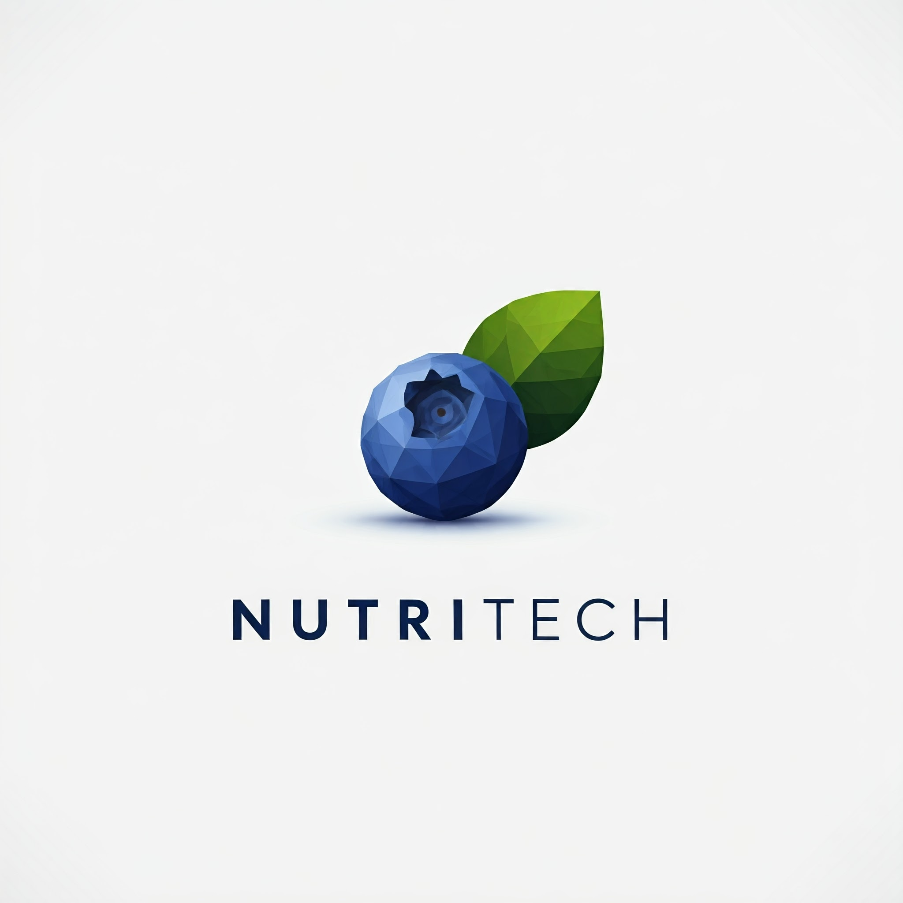

# NUTRITECH

 <h1>DESCRIÇÃO</h1>

# 🗂️SPRINTS
| Sprint  | Datas   | Relatórios                                     |
|:-------:| --------------------- |---------------------------------------------- |
|  1  | :calendar:  ➡ (20/09/2024) |
|  2  | :calendar:  ➡ (08/10/2024) |
|  3  | :calendar:  ➡ (08/11/2024  |

|       DESAFIO       |    
|O objetivo é especificar e construir uma aplicação web que permita aos usuários registrar e monitorar a ingestão diária de calorias e nutrientes, auxiliando no controle da alimentação e na manutenção da saúde.

|       RESTRIÇÕES DE PROJETO E TECNOLOGIA      |          
| - As seguintes restrições devem ser cumpridas no desenvolvimento da aplicação:     
| 1.	Back end: TypeScript e Node.js;          
| 2.	Front end: React TypeScript;        
| 3.	Armazenamento: SGBD MongoDB;       
| 4.	Documentação: GitHub;     
| 5.	Usar alguma ferramenta de gestão para gerenciar o backlog do produto. 

# 📑PRODUCT BACKLOG
|  Requisitos Funcionais       |
|------------------------------|
| => criar identidade visual da empresa e criar paleta de cores para o site;
| INSERÇÃO DE DIETA
| => alimento (grupo alimentar), prato (quantidade), horário, tipo de refeição (desjejum, almoço, ceia etc...), calorias;
| INSERÇÃO DE METAS
| => ganho de peso, perca de peso, ganho de massa muscular;
| => exibição dos objetivos e metas será por meio de gráficos;
| => adicionar alarmes para as refeições ou lembretes;
| O SISTEMA TEM QUE TER ALGUM DIFERENCIAL ( EX: PROGRESSO DA DIETA, MODO CLARO E NOTURNO, ENTRE OUTROS ). 
| NECESSÁRIO ALGUMA FERRAMENTA DE SEGURANÇA (EX:  GERAR CAPTCHA).

|   Requisitos Não Funcionais                                                                                                                      
|------------------------------|
| INSERÇÃO DE DADOS, MONITORAMENTO, CONTROLE DA ALIMENTAÇÃO; 
| INSERÇÃO DE USUARIO => nome, email, senha, altura, peso, idade, sexo;              
| AUTENTICAÇÃO DO USUÁRIO (VALIDAR SENHA):      
| -VERIFICAR SE O USUÁRIO ESTÁ CADASTRADO NO BANCO DE DADOS;  
| -VERIFICAR SENHA;                                           
| -VERIFICAR STATUS DO USUÁRIO;                               
| -VERIFICAR SE É O PRIMEIRO ACESSO AO SISTEMA;                                                                         
| -VERIFICAR ESPAÇOS / CAMPOS EM BRANCO;                      
| -SITUAÇÃO(STATUS) OK.                                                                                                
| INSERÇÃO DE CARDÁPIO (todos alimentos / produtos consumíveis que serão compatíveis com as dietas).

# USER STORIES
|Ator          |Ação                         |Motivo                        |
|--------------|-----------------------------|------------------------------|
|Como usuario eu quero| O controle das calorias e nutrientes ingeridos ao longo do dia | Fundamental para a manutenção da saúde e bem-estar ao longo da vida.
|Como usuario eu quero| Gerenciamento do peso e do fornecimento de energia advindo dos alimentos | Necessário e essencial para as atividades diárias.
|Como usuario eu quero| Dieta que controle a ingestão de proteínas, carboidratos, gorduras, vitaminas e minerais | O acompanhamento nutricional é vital para o manejo adequado da condição e para evitar complicações de saúde.
|Como usuario eu quero| Acompanhar o progresso da minha dieta | Demonstra o desempenho e atividade de forma a motivar o usuário e o mesmo poder comparar seu desempenho.

# BURNDOWN

# WIREFRAME

# 🔗 LINKS

### 🧮 TRELLO 
[Clique Aqui]()

### 📖 REQUISITOS DO CLIENTE
[Clique Aqui]()

### 🖌️ CORES
[Clique Aqui]()

### BD 
[Clique Aqui]()

### 🎨 FIGMA
[Clique Aqui]()

# :computer: EQUIPE

|CARGO | NOME| SOCIAL MEDIA |
|------|-----|:--------------:|
| P.O (Product Owner) |   André Ventura   |     |    
| Scrum Master |   Andre Michel   |     |  
| Dev     |   Eduardo Henrique  |     |  
| Dev     |   Valcir  |     |   
| Dev     |   Bruno Henrique   |     |  
| Dev     |   Danilo Alves   |     |  
